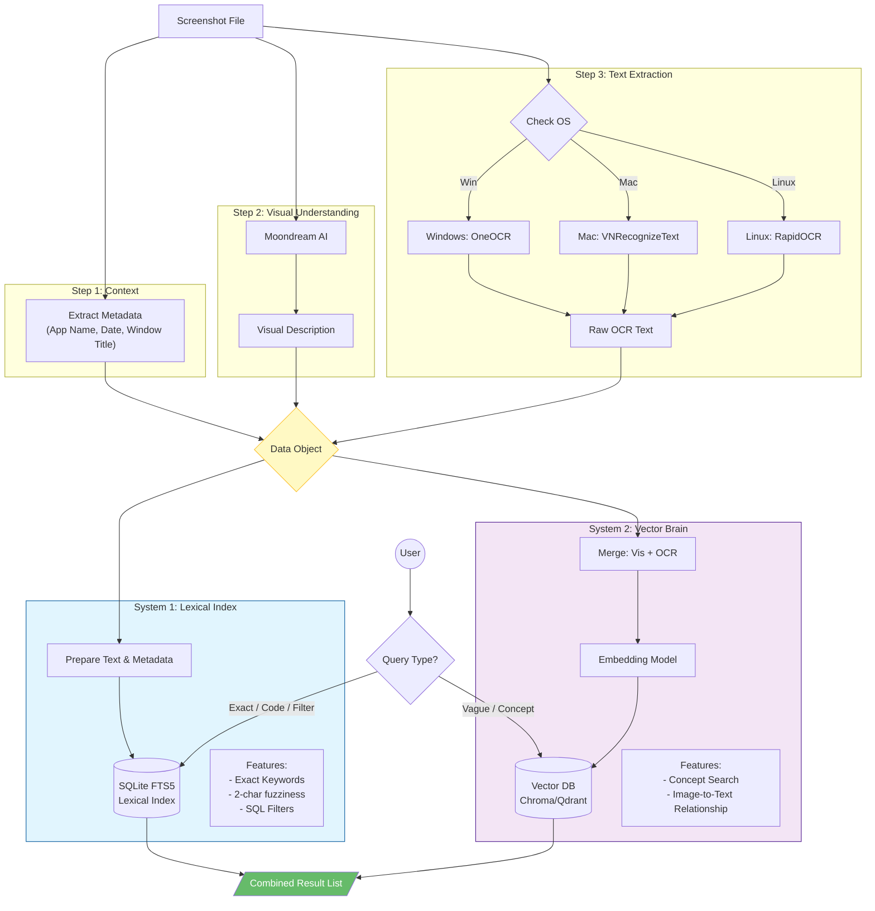

```mermaid
flowchart TD
%% --- INGESTION PIPELINE ---
Input[Screenshot File]

    subgraph Metadata_Ext ["Step 1: Context"]
        Meta["Extract Metadata<br/>(App Name, Date, Window Title)"]
    end

    subgraph Visual_Pipe ["Step 2: Visual Understanding"]
        Moondream[Moondream AI]
        VisDesc[Visual Description]
    end

    subgraph OCR_Pipe ["Step 3: Text Extraction"]
        OS_Check{Check OS}
        WinOCR[Windows: OneOCR]
        MacOCR[Mac: VNRecognizeText]
        LinOCR[Linux: RapidOCR]
        RawText[Raw OCR Text]
    end

    %% Connections for Ingestion
    Input --> Meta
    Input --> Moondream --> VisDesc
    Input --> OS_Check

    OS_Check -- "Win" --> WinOCR
    OS_Check -- "Mac" --> MacOCR
    OS_Check -- "Linux" --> LinOCR

    WinOCR --> RawText
    MacOCR --> RawText
    LinOCR --> RawText

    %% --- MERGING & STORAGE ---

    DataObj{Data Object}

    Meta --> DataObj
    VisDesc --> DataObj
    RawText --> DataObj

    %% Split to Systems
    DataObj --> Sys1_Ingest
    DataObj --> Sys2_Ingest

    %% --- SYSTEM 1: EXACT SEARCH ---
    subgraph System_Exact ["System 1: Lexical Index"]
        direction TB
        Sys1_Ingest["Prepare Text & Metadata"]
        FTS_DB[("SQLite FTS5<br/>Lexical Index")]

        note1["Features:<br/>- Exact Keywords<br/>- 2-char fuzziness<br/>- SQL Filters"]
    end

    %% --- SYSTEM 2: SEMANTIC SEARCH ---
    subgraph System_Semantic ["System 2: Vector Brain"]
        direction TB
        Sys2_Ingest["Merge: Vis + OCR"]
        Embed[Embedding Model]
        Vector_DB[("Vector DB<br/>Chroma/Qdrant")]

        note2["Features:<br/>- Concept Search<br/>- Image-to-Text Relationship"]
    end

    Sys1_Ingest --> FTS_DB
    Sys2_Ingest --> Embed --> Vector_DB

    %% --- SEARCH QUERY FLOW ---
    User((User))
    QueryType{Query Type?}

    User --> QueryType

    QueryType -- "Exact / Code / Filter" --> FTS_DB
    QueryType -- "Vague / Concept" --> Vector_DB

    FTS_DB --> Results
    Vector_DB --> Results

    Results[/Combined Result List/]

    %% Styling
    style System_Exact fill:#e1f5fe,stroke:#01579b
    style System_Semantic fill:#f3e5f5,stroke:#4a148c
    style DataObj fill:#fff9c4,stroke:#fbc02d
    style Results fill:#66bb6a,color:#fff
```
