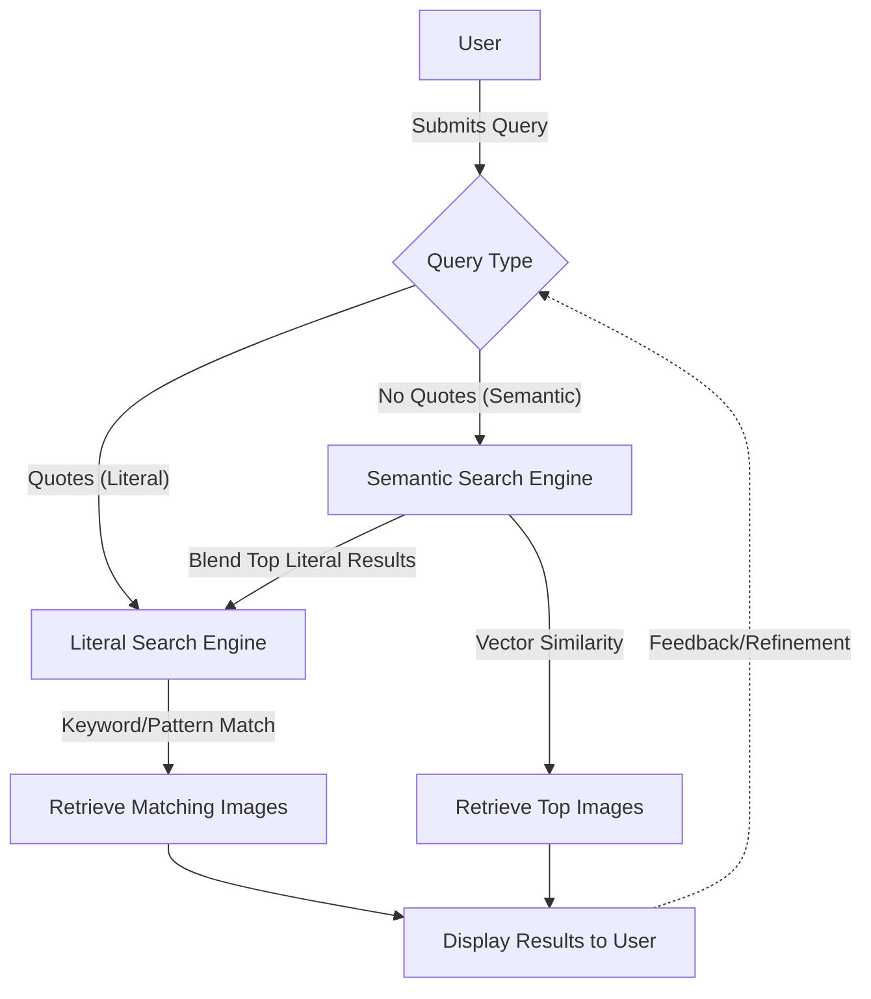
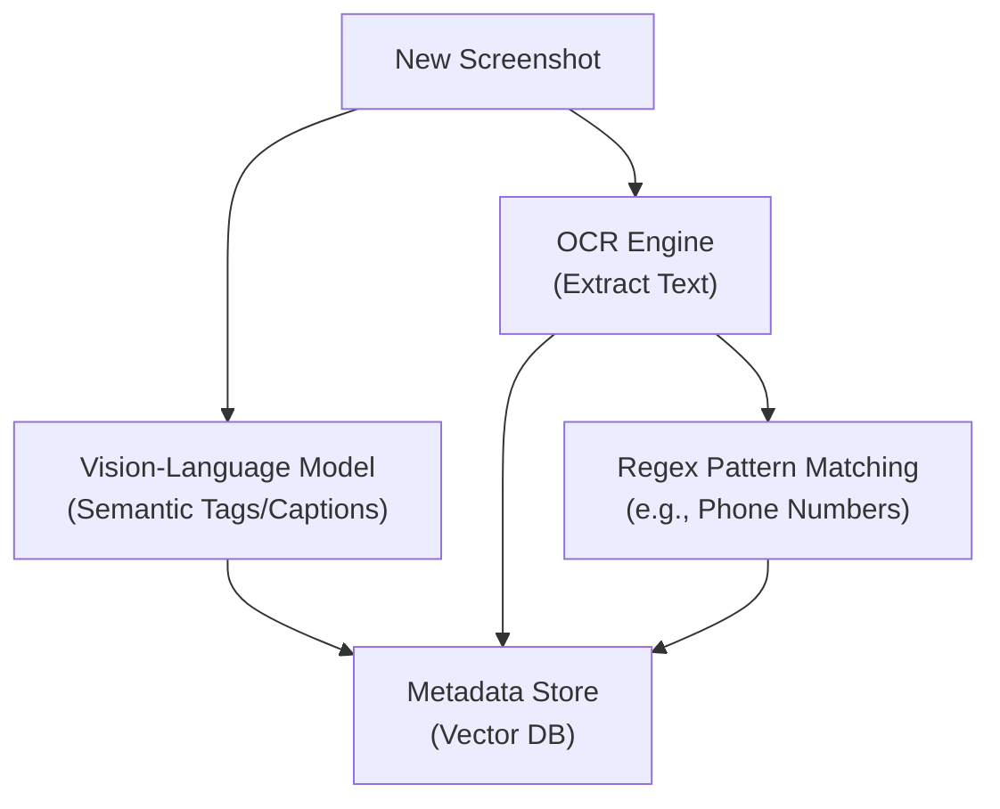

# 📸 Semantically Searchable Screenshots App

This application allows users to search their screenshots folder using either **semantic search** (for concepts/objects) or **literal search** (for exact text or patterns). Users can specify literal search by wrapping their query in quotes; otherwise, semantic search is used, with optional blending of literal results for top matches.

---

## Features

- **Semantic Search:** Find screenshots containing objects or concepts (e.g., "chair").
- **Literal Search:** Find screenshots containing exact text or patterns (e.g., phone numbers, "'الراجل'").
- **Multilingual Support:** Works with screenshots containing text in various languages.
- **User Choice:** Users select search mode via query syntax (quotes for literal).

---

## System Architecture

### Overview

1. **Ingestion:** Screenshots are processed to extract both visual and textual information.
2. **Tagging:**
   - Vision-language models generate semantic tags/captions.
   - OCR extracts all visible text.
   - Regex is applied to OCR text for patterns (e.g., phone numbers).
3. **Indexing:** All metadata (tags, captions, OCR text) is stored in a vector database.
4. **Query Processing:**
   - User query is classified as literal or semantic.
   - Literal queries use keyword/pattern search.
   - Semantic queries use vector search, optionally blending literal results.
5. **Retrieval:** Ranked results are returned to the user.

---

## Mermaid System Diagrams

### Query Processing Flow

### Tagging & Indexing Pipeline

---

## Usage

1. **Add screenshots** to the monitored folder.
2. **Search:**
   - For semantic search: type a concept (e.g., `chair`).
   - For literal search: wrap your query in quotes (e.g., `'الراجل'` or `"555-1234"`).
3. **View results** ranked by relevance.

---

## Technology Stack

- **Vision-Language Model:** CLIP, Tag2Text, or RAM++
- **OCR:** Tesseract, EasyOCR, or PaddleOCR
- **Database:** Pinecone, Milvus, or Weaviate
- **Backend:** Python (FastAPI/Flask)
- **Frontend:** React/Electron or native desktop UI

---

## Notes

- The system supports both semantic and literal search, giving users flexibility and accuracy.
- The architecture is modular and can be extended to support more languages or advanced search features.
